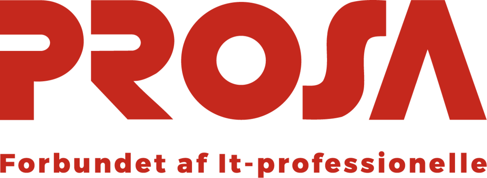
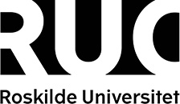

## About NWPT

NWPT is a series of annual regional-scope workshops on programming
theory, targeted especially at younger researchers. In 2024, the
workshop will take place in Copenhagen, Denmark. We hope this will be
a nice opportunity to present recent results and/or work-in-progress,
and to meet colleagues from the Nordic and Baltic countries. We
encourage PhD students and postdocs to contribute. Topics of interest
include (but are not limited to):

- semantics of programming languages
- programming language design and programming methodology
- programming logics
- formal specification of programs
- program verification
- program construction
- tools for program verification and construction
- program transformation and refinement
- real-time, hybrid/cyber-physical systems modeling and verification
- models of concurrency and distributed computing
- model checking
- model-based testing
- language-based security.

## Important dates (Tentative)

<s>Submission of abstracts: September 24, 2024 23:59 AoE</s> 
Extended submission of abstracts: October 1, 2024 23:59 AoE 
Notification: October 15, 2024 AoE 
Registration deadline: October 28, 2024, 12:00 CEST 
Final version abstract submission: October 29, 2024, 23:59 AoE 
Conference dates: 6-8 November 2024

* <a href="call-for-paper.html">Call for papers</a>
* <a href="call-for-paper.html#program-committee">Program Committee</a>

## Invited speakers

* [João Saraiva](https://www.inesctec.pt/en/people/joao-alexandre-saraiva) 
  Professor Auxiliar 
  Department of Informatics, University of Minho and HASLab / INESC TEC, Portugal 
  _On recent work on the area of programming, languages and their energy consumption_
* [Sam Staton](https://www.cs.ox.ac.uk/people/samuel.staton/main.html) 
  Professor of Computer Science 
  Department of Computer Science, University of Oxford, UK 
  _On probabilistic programming and/or programming languages for quantum computation_
* [Martin Berger](https://martinfriedrichberger.net/) 
  Senior Lecturer, University of Sussex & Researcher at HiSilicon 
  _On GPUs and LTL_

## Organisation committee

  * Michael Kirkedal Thomsen, University of Copenhagen and University of Oslo
  * Maja Hanne Kirkeby, Roskilde University
  * Morten Rhiger, Roskilde University
  * Jens Classen, Roskilde University
  * Joachim Tilsted Kristensen, University of Oslo
  * Fritz Henglein, University of Copenhagen and Deon Digital

For questions, contact Michael Kirkedal Thomsen <m.kirkedal@di.ku.dk>.

## Sponsor and support

<figure>
  
  <figcaption>Support was gratefully received from the Carlsberg Foundation, grant CF24-0923.</figcaption>
</figure>
<figure>
  
  <figcaption>Sponsorship was gratefully received from the PROSA, Danish union for IT-professionals.</figcaption>
</figure>
<figure>
  
  <figcaption>University of Copenhagen supports NWPT'24 with location and organisation.</figcaption>
</figure>
<figure>
  
  <figcaption>Roskilde University supports NWPT'24 with organisation and merchandise.</figcaption>
</figure>

### Becomming an Industrial Sponsors

Would you like to sponsor keynote and reception Friday, afternoon, to make it open and free to the public (up to the capacity of auditorium)? We provide multiple options for you.

* <b>Bronze (DKK 5000):</b> 
  Your logo and link on the NWPT 2024 website and in symposium materials; your roll-up or poster in the social space outside the symposium lecture room; one free registration (which can be donated to somebody else). Your sponsorship contributes to discounted student registration by partially covering on-site food and facility costs for students.
* <b>Silver (DKK 10000), final reception sponsor:</b> 
  All of Bronze, plus: Named sponsor of final reception; with sponsor presentation (in lecture room or social space) at the beginning of the industrial reception.

If you are interestend in becomming a sponsor for NWPT'24, you can contact Michael Kirkedal Thomsen <a href="mailto:m.kirkedal@di.ku.dk">m.kirkedal@di.ku.dk</a>.

## Contact

For questions, contact Michael Kirkedal Thomsen <m.kirkedal@di.ku.dk>.
