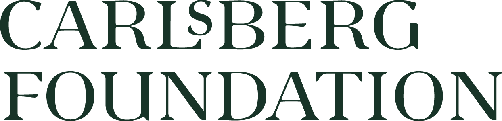

## About NWPT

NWPT is a series of annual regional-scope workshops on programming
theory, targeted especially at younger researchers. In 2024, the
workshop will take place in Copenhagen, Denmark. We hope this will be
a nice opportunity to present recent results and/or work-in-progress,
and to meet colleagues from the Nordic and Baltic countries. We
encourage PhD students and postdocs to contribute. Topics of interest
include (but are not limited to):

- semantics of programming languages
- programming language design and programming methodology
- programming logics
- formal specification of programs
- program verification
- program construction
- tools for program verification and construction
- program transformation and refinement
- real-time, hybrid/cyber-physical systems modeling and verification
- models of concurrency and distributed computing
- model checking
- model-based testing
- language-based security.

## Important dates (Tentative)

Submission of abstracts: September 24, 2024 23:59 AoE 
Notification: October 15, 2024 
Registration deadline: October 22, 2024, 23:59 AoE 
Final version abstract submission: October 29, 2024, 23:59 AoE 
Conference dates: 6-8 November 2024

## Organisation committee

  * Michael Kirkedal Thomsen, University of Copenhagen and University of Oslo
  * Maja Hanne Kirkeby, Roskilde University
  * Morten Rhiger, Roskilde University
  * Jens Classen, Roskilde University
  * Joachim Tilsted Kristensen, University of Oslo
  * Fritz Henglein, University of Copenhagen and Deon Digital

## Invited speakers

* [João Saraiva](https://www.inesctec.pt/en/people/joao-alexandre-saraiva) 
  Professor Auxiliar 
  Department of Informatics, University of Minho and HASLab / INESC TEC, Portugal 
  _On recent work on the area of programming, languages and their energy consumption_
* [Sam Staton](https://www.cs.ox.ac.uk/people/samuel.staton/main.html) 
  Professor of Computer Science 
  Department of Computer Science, University of Oxford, UK 
  _On probabilistic programming and/or programming languages for quantum computation_
* TBD

## Program Committee

### Chairs
  * Fritz Henglein, University of Copenhagen and Deon Digital, Denmark
  * Maja Hanne Kirkeby, Roskilde University, Denmark
  * Michael Kirkedal Thomsen, University of Copenhagen, Denmark and University of Oslo, Norway

### Sponsor

<figure>
  
  <figcaption>Support was gratefully received from the Carlsberg Foundation, grant CF24-0923.</figcaption>
</figure>

### Members

  * Alceste Scalas, Technical University of Denmark, Denmark
  * Antonis Achilleos, Reykjavik University, Iceland
  * Antti Valmari, University of Jyväskylä, Finland
  * Chad Nester, University of Tartu, Estonia
  * Danny Bøgsted Poulsen, Aalborg University, Denmark
  * Dylan McDermott, Reykjavik University, Iceland
  * Fabrizio Montesi, University of Southern Denmark, Denmark
  * Håkon Robbestad Gylterud, University of Bergen, Norway
  * Jaakko Järvi, University of Turku, Finland
  * Johannes Borgström, Uppsala University, Sweden
  * Keijo Heljanko, University of Helsinki, Finland
  * Magnus Madsen, Aarhus University, Denmark
  * Magnus Myreen, Chalmers University of Technology, Sweden 
  * Marina Waldén, Åbo Akademi University, Finland
  * Marjan Sirjani, Malardalen University, Sweden
  * Martin Elsman, University of Copenhagen, Denmark
  * Martin Steffen, University of Oslo, Norway
  * Mikhail Barash, University of Bergen
  * Morten Rhiger, Roskilde University, Denmark
  * Niccolò Veltri, Tallinn University of Technology, Estonia
  * Patrick Bahr, IT-University of Copenhagen, Denmark
  * Philipp Ruemmer, University of Regensburg, Germany and Uppsala University, Sweden
  * Roberto Guanciale, KTH Royal Institute of Technology, Sweden
  * Sandro Stucki, Amazon, Sweden
  * Thomas T. Hildebrandt, University of Copenhagen, Denmark
  * Violet Ka I Pun, Western Norway University of Applied Sciences, Norway
  * Volker Stolz, Western Norway University of Applied Sciences and University of Oslo, Norway
  * Wojciech Mostowski, Halmstad University, Sweden
