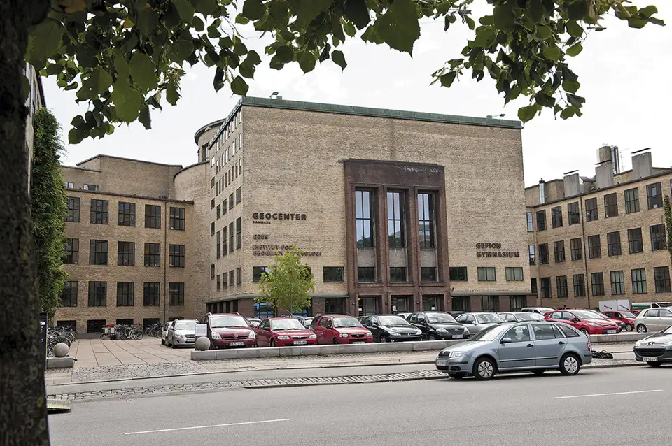
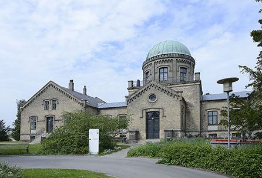
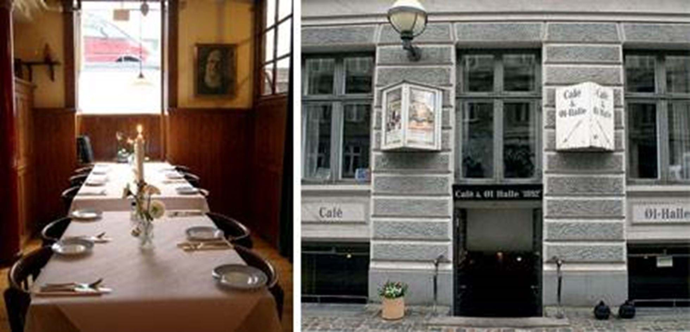

# Venue

NWPT'24 will be held at University of Copenhagen, Denmark. 

## Workshop
More specifically It will be at: 
Auditorium A and B 
Geocenter Copenhagen, University of Copenhagen 
Østre Voldgade 10 
1350 Copenhagen 
<a href="https://maps.app.goo.gl/hdGqFTtERDuGTZoB6" target="_blank">Link to Google Maps</a>

<a href="https://ign.ku.dk/english/contact/oestervoldgade/groundfloor/">Map of the location.</a> The auditoriums are on the 3rd floor. 

The central location in the heart of Copenhagen gives easy access to idyllic parks (Kings garden and the Botanical garden), hotels, and transport to the airport from Nørreport station.

<figure>
  
  <figcaption>Geocenter Copenhagen of University of Copenhagen in Copenhagen.</figcaption>
</figure>

Today, the building is part of the <a href="https://en.wikipedia.org/wiki/City_Campus_(University_of_Copenhagen)" target="_blank">City Campus of University of Copenhagen</a>, but was originally built for 
<a href="https://historie.dtu.dk/dtus-historie/steder/adresser/ostervoldgade" target="_blank">Polyteknisk Læreanstalt</a> (today Danish Technical University, DTU), that was housed here until they moved to their current location in 1974.

## Welcome Reception
We will have a welcome reception at will be held at the old <a href="https://en.wikipedia.org/wiki/%C3%98stervold_Observatory" target="_blank">Copenhagen University Observatory</a>:

Østre Voldgade 3, 
1350 København K 
<a href="https://maps.app.goo.gl/PKjXXf9ebTyjPNfA8" target="_blank">Google pin</a>

<figure>
  
  <figcaption>Copenhagen University Observatory.</figcaption>
</figure>

Today it houses the <a href="https://www.aicentre.dk/" target="_blank">Pioneer Centre for Artificial Intelligence</a> but is 1861 is was build at a replacement for the observatory in Rundetårn. The observatory is build on top of the old bastions of Copenhagen and therefore hold a prominent view of the city.

We will start the reception with a small tour, (if the weather permits) have a view of Copenhagen from roof of the observatory and see the double refractor telescope from 1895.

Following this, there will be served tapas and drinks in a lounge area of the building. We also plan a simple activity that should encourage conversation.

## Workshop Dinner
The workshop dinner will be held from 18:00 to 22:00 at

"Café og Ølhalle 1892" 
Rømersgade 22 
1362 København K 
<a href="https://maps.app.goo.gl/e4YMZL91bdVeL8f18" target="_blank">Google pin</a>

<figure>
  
  <figcaption>Cafe og Ølhalle 1982.</figcaption>
</figure>

The is the basement location of the workers museum.

The standard menu, will follow a classical Danish Christmas food:

* Starter: Gravad laks m. rævedressing. (Kind of marinated salmon)
* Main dish: Confiteret andelår m. brune kartofler & skysauce. (Confit duck leg with caramelised potato and sauce)
* Dessert: Ris a la mande (kind of Danish rice pudding) + coffee/tea

There will also be alternative dietary restricted options.

Throughout, the dinner you can choose from a selection of beers, wine and soft drinks.

