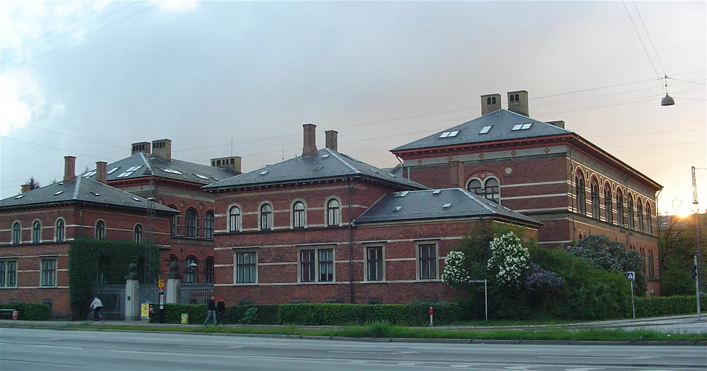
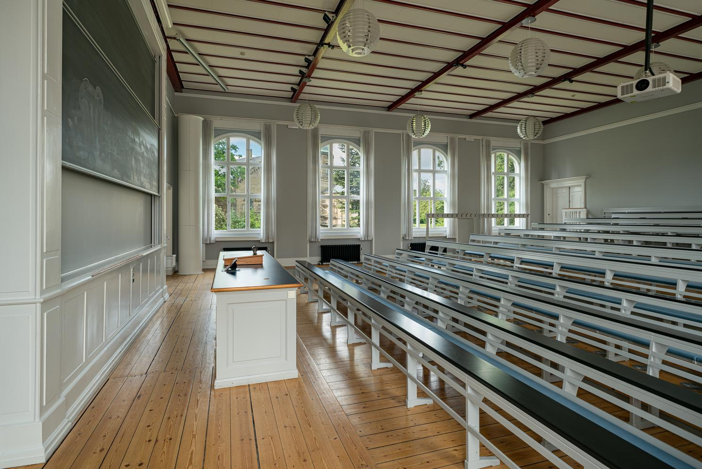
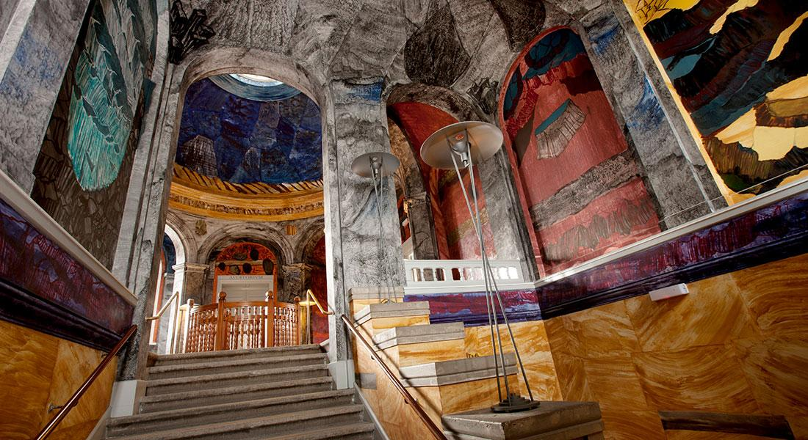

# Registration

Registration will open later.

We expect a participation fee of no more than 1.800 DKK including lunches and coffee (all three days), conference dinner, social event, and reception. 

# Venue

NWPT'24 will be held at University of Copenhagen, Denmark. 
More specifically the at the old auditorium of the Natural History Museum, Denmark right in the centre of Copenhagen. The Natural History Museum is part of the University of Copenhagen.

<a href="https://maps.app.goo.gl/DaLvAt5PyymeeNQo9" target="_blank">Link to Google Maps</a>

Its idyllic surroundings and central location in the heart of Copenhagen makes the Natural History Museum Denmark the perfect venue for events and meetings.

<figure>
  
  <figcaption>Natural History Museum in Copenhagen.</figcaption>
</figure>

## The Auditorium

The workshop will be held at the historic Auditorium. If walls could speak, the beautiful old Auditorium on Øster Voldgade would tell a myriad of stories about the countless scientific discoveries that have been presented in this classic venue. The large windows, the abundant light and the stunning views of the Botanical Garden. 

<figure>
  
  <figcaption>The auditoruim of Natural History Museum.</figcaption>
</figure>

You will enter via the colourful stairwell rotunda, decorated by the famous Danish artist-cum-geologist, <a href="https://en.wikipedia.org/wiki/Per_Kirkeby" target="_blank">Per Kirkeby</a>.

<figure>
  
  <figcaption>The Kirkeby Rotunda.</figcaption>
</figure>

Source: <a href="https://snm.dk/en/hold-your-event-or-meeting-natural-history-museum-denmark" target="_blank">snm.dk</a>

